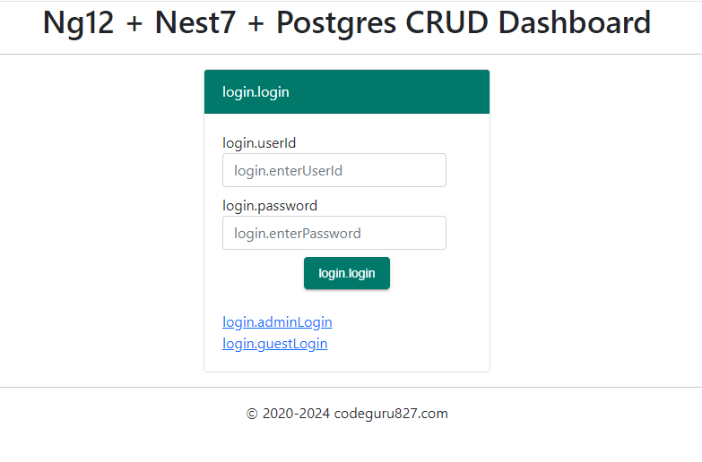
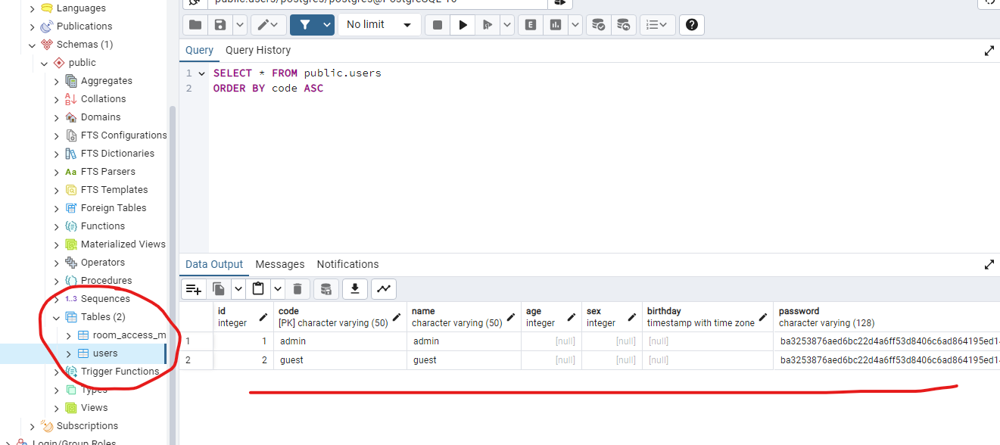
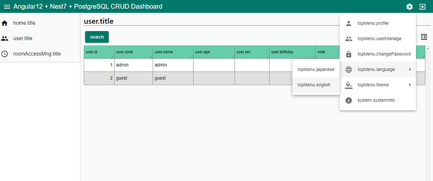

# ng12-nest7-postgres-crud-dashboard

> `Angular12` + `Nest.js7`+ `PostgreSQL16` + **CRUD Dashboard** - i18n (English + Japanese)

```yaml
This is a sample dashboard app using Angular and NestJS.
The database uses PostgreSQL.
Simple CRUD functionality is achieved with a minimum of configuration.
```

```yaml
Angular、NestJS を使用したサンプル画面です。
DB は PostgreSQL を使用しています。
最低限の構成で、簡単な CRUD 機能を実現しています。
```



## Prerequisites (動作確認環境)

```yaml
・node.js           16.12.0
・npm               8.1.0
・PostgreSql        15.1
・ブラウザ          Chrome、Edge
```

## Preparing DB (PostgreSQL)

・**Create Table** (テーブル作成)

```sql
-- `users` table (ユーザテーブル)
CREATE TABLE users (id serial, code varchar(50), name varchar(50), age int, sex int, birthday timestamptz, password varchar(128), note varchar(256), auth jsonb, PRIMARY KEY(code));

-- `room_access_mng` table (入退室管理テーブル)
CREATE TABLE room_access_mng (id serial, room_cd varchar(10), user_id int, entry_dt timestamptz, exit_dt timestamptz, note varchar(256), image_file text);
```

・**Generate Initial Users** (初期ユーザ作成)

```sql
INSERT INTO users (code, name, password, note, auth) VALUES ('admin', 'admin','ba3253876aed6bc22d4a6ff53d8406c6ad864195ed144ab5c87621b6c233b548baeae6956df346ec8c17f5ea10f35ee3cbc514797ed7ddd3145464e2a0bab413', 'password:123456', '[10, 11, 12, 13, 20, 21, 22, 23]');

INSERT INTO users (code, name, password, note, auth) VALUES ('guest', 'guest','ba3253876aed6bc22d4a6ff53d8406c6ad864195ed144ab5c87621b6c233b548baeae6956df346ec8c17f5ea10f35ee3cbc514797ed7ddd3145464e2a0bab413', 'password:123456', '[20, 21, 22, 23]');
```

・**Change the DB Timezone** (DB のタイムゾーンを変更してください。)

```sql
ALTER DATABASE データベース名 SET timezone TO 'Asia/Tokyo';
```

・**DB Connection Settings** (接続設定)  
To set the connection, set the environment variables as follows.
(The following is an example for Windows.)

接続の設定は、以下のように環境変数をセットしてください。
（以下は Windows の例です。）

```yaml
setx DB_HOST localhost
setx DB_NAME postgres
setx DB_USER postgres
setx DB_PASSWORD postgres
setx DB_PORT 5432
setx DB_SSL false
```

Alternatively, you can rewrite the following part of `apps\api\src\environments\environment.ts`.
(This will be used if the environment variable is not set.)

あるいは、`apps\api\src\environments\environment.ts`の以下の部分を書き換えることもできます。
（環境変数がセットされていない場合はこちらが使用されます。）

```ts
  pgConf: {
    user: 'postgres',
    password: 'postgres',
    host: 'localhost',
    port: 5432,
    database: 'postgres',
    ssl: false,
  },
```



## How To Run (実行方法)

・**Install npm packages** (npm パッケージのインストール)

```bash
$ npm install
```

・**Build** (ビルド)

```bash
$ npm run build
```

・**Run Dev Server** (開発環境での起動)

```bash
$ npm start
```

Visit http://localhost:4200/



## Run on Render hosting (render.com での実行)

The build command will perform both installation and building as follows:

ビルドコマンドは、以下のようにインストールとビルドを両方行うようにします。

```bash
$ npm install && npm run build
```

---

&copy; 2020 - 2024 @codeguru827

All rights reserved.
